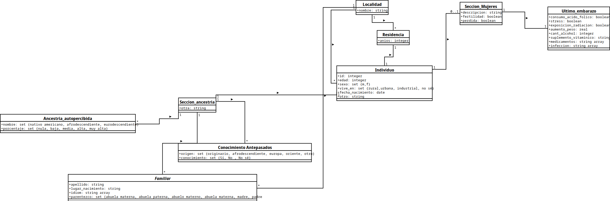

# Propuesta de trabajo de desarrollo

## Universidad Nacional de la Patagonia San Juan Bosco
## Facultad de Ingeniería - Sede Trelew
## Licenciatura en Sistemas
## Aspectos Legales y Profesionales

### Cátedra:

- Dr. Guillermo Cosentino
- Lic. Bruno Zappellini

#### Integrantes:

- Luciano Serruya Aloisi
- Pablo Toledo Margalef

---

## Introducción

El Proyecto ORIGENES busca estudiar cómo se relacionan los orígenes étnicos y etimológicos de las mujeres con distintos problemas que pueden surgir en sus embarazos.

Para ello, realizan encuestas a las voluntarias que acepten participar; en la encuesta registran datos como edad, ciudad de origen, y fecha de nacimiento (nombre y apellido, y DNI no son relevantes).

Sobre sus antepasados preguntan qué tipo de ancestría tienen (puede ser nativo americano, afrodescendiente, o eurodescendiente) y en qué porcentaje (bajo, medio, alto, muy alto). También le solicitan a la encuestada datos sobre sus familiares y su ancestría (como lugar de nacimiento, idioma hablado, y cuál es su relación con esa persona)

Con respecto a sus embarazos preguntan si son fértiles o no, o si han sufrido abortos espontáneos. También se pregunta si durante su último embarazo han consumido alcohol, ácido fólicos o medicamentos; si han estado expuestas a radiación, si han sufrido alguna infección, si han sufrido *stress*, y cuánto han subido de peso.

## Desarrollo

La siguiente propuesta consiste en la implementación de una aplicación web para que los integrantes del Proyecto ORIGENES pueden cargar las encuestas realizadas y almacenarlas en una base de datos.

El modelo de datos necesario para almacenar las encuestas es el siguiente:

